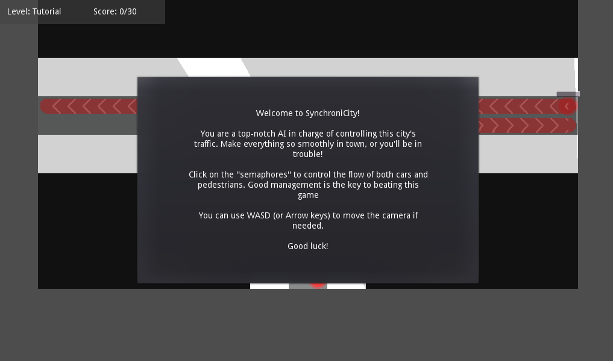

# SynchroniCity

https://ev1lbl0w.itch.io/synchronicity

Solve traffic problems in a busy city!

You are a sophisticated AI tasked with fixing the traffic from this city! Prevent the chaos by changing traffic lights. It won't be easy, though!

This was an entry for GMTK 2020 game jam, made with Godot Engine.

## Screenshots

## File structure
For anyone who wants to modify/stufy the game's code, here's a general overview of the file structure

- `assets` - Assets for the game
  - `models` - All 3D models
  - `music` - All sound files
  - `textures` - All texture files
  - `resources` - All resource files *(.tres)* made by Godot
- `src` - All game scripts and scenes
  - `objects` - All game entities
    - `debug` - Debug objects used in the early development
    - `entities` - Entities that wal around *(cars and pedestrians)*
    - `spawner` - Objects that manipulate entities *(entity spawner and semaphores)*
  - `scenes` - All game scenes that control game logic
    - `levels` - All levels in the game

## Contributors

- **João Lourenço** _(@iK4tsu)_ - Programmer, level designer, bug tester
- **Ricardo Subtil** _(@Ev1lbl0w)_ - Programmer, level designer, bug tester
- **Luís Ferreira** _(@ljmf00)_ - Level designer, bug tester
- **Raquel Sofia** _(@cutietruck)_ - Sound artist, level designer, bug tester
- **Francisco Jordão** _(@CubicPaladin)_ - Concept idea, general guidance

## Disclaimer

This game was coded in 48 hours, so don't expect any good code and concise decisions.